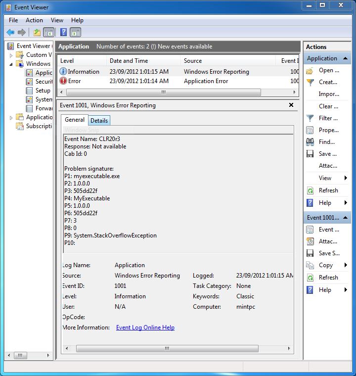
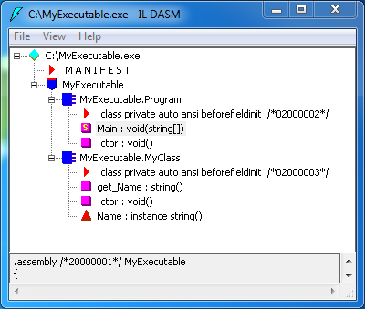
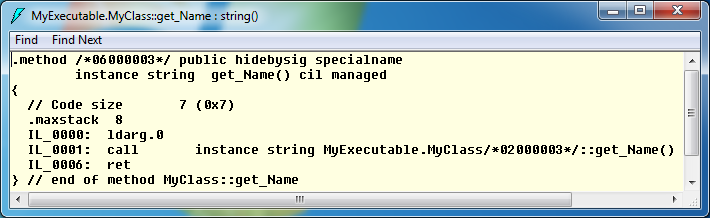

+++
slug = "debugging-using-windows-error-reporting"
title = "C#: Debugging using Windows Error Reporting"
date = 2012-09-23
disqus_identifier = "cqjosdh"
+++

Debugging a fatal uncatchable exception in a production environment, where we have little information can leave us feeling powerless as a developer. Here I discuss a strategy I used to resolve an uncatchable `StackOverflowException`.

When an exception is thrown that is either uncaught or uncatchable it is recorded in the Windows Application event log. You can view the event lot by opening the _Control Panel -> Administrative Tools -> Event Viewer_ and selecting the Application log on the left. The exception details are found in an Information level log entry with the source set to Windows Error Reporting.

Each of the lines in the problem signature contain useful information (thanks to this [post](http://blogs.msdn.com/b/oanapl/archive/2009/01/30/windows-error-reporting-wer-and-clr-integration.aspx)):

`P1` = The filename of the executable.  
`P2` = The assembly version for the executable in `P1`.  
`P3` = The assembly timestamp for the executable in `P1`.  
`P4` = The assembly where the fault occurred.  
`P5` = The assembly version for the assembly in `P4`.  
`P6` = The assembly timestamp for the assembly in `P4`.  
`P7` = The token for the method where the fault occurred.  
`P8` = The IL offset into the method specified in `P7`.  
`P9` = The name of the exception that caused the fault.  

There are numerous ways to take the information above and find out where in the offending assembly the fault is occurring. The method I use does not require the application to be running in the debugger and you can use a production release built DLL to find out where the exception has occurred and possibly what caused it.

Open `ildasm.exe`, which can be found at the path below. If the path is not present you may need to install the [Windows 7 SDK](http://www.microsoft.com/en-us/download/details.aspx?id=3138). Note the path may not contain `(x86)` and may have a different version in place of `v7.0A`.
`C:\Program Files (x86)\Microsoft SDKs\Windows\v7.0A\Bin\ildasm.exe`

Using the main menu, select _File -> Open_, and open the DLL/EXE specified in P4. If you have multiple versions of the DLL make sure you get the correct version indicated in P5. In the _View_ menu change the following settings:

1. Turn off _Sort by Name_
2. Turn on _Show Token Values_

Manually expand each class and double-click on each method. A window will open for each showing a token in the function. The token will follow `.method` in the format `/*06XXXXXX*/`. The methods will be sorted by the token; keep looking through them until you find the method with a token where the `XXXXXX` is the value specified in `P7`.

Once you have found the method, look at it's IL code that is displayed at the beginning of each line in the popup for that method. The instruction that caused the fault will be proceeded by `IL_YYYY` where `YYYY` is `P8`. In the screenshots we can see the method where the exception occurred is `MyClass.get_Name()` method, which is the get for the `Name` property. We can also see that the line the exception occurred on was the first instruction.

Using this method we now know where the `StackOverflowException` occurred, and can look at surrounding code to find the root cause. In our example the overflow is caused by the property returning itself.

The code used in the example is:


// MyClass.cs
namespace MyExecutable
{
    /// 

    /// An example class.
    /// 

    class MyClass
    {
        /// 

        /// The name of the object. Will return itself to demonstrate 
        /// unbounded recursion.
        /// 

        public string Name
        {
            get
            {
                return Name;
            }
        }
    }
}



// MyExecutable.cs

namespace MyExecutable
{
    /// 

    /// The MyExecutable application, which will create an object and print it's name.
    /// A StackOverflowException will be thrown when calling obj.Name.
    /// 

    class Program
    {
        static void Main(string[] args)
        {
            MyClass obj = new MyClass();
            Console.WriteLine("My object's name is {0}.", obj.Name);
        }
    }
}

