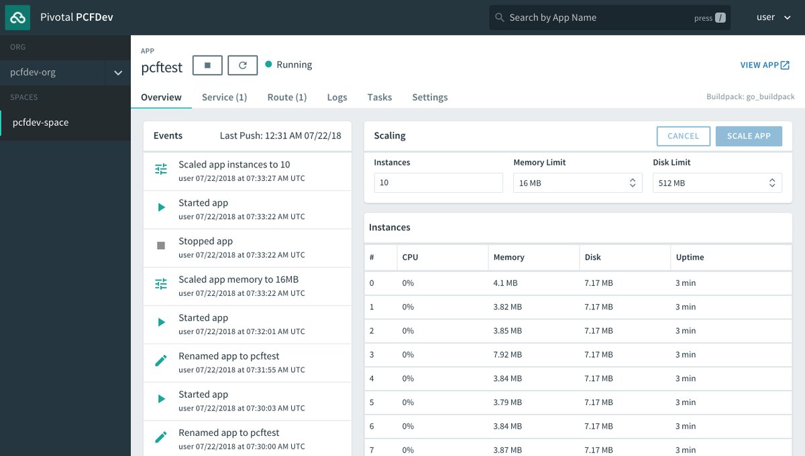

+++
slug = "pivotal-cloud-foundry-pcf-dev"
title = "Reviewing PCFDev"
date = 2018-07-22
disqus_identifier = "wqtciws"
+++

Today I learned it's remarkably easy to use Pivotal Cloud Foundry (PCF) locally using [PCF Dev](https://pivotal.io/pcf-dev). I was able to bring up PCF on my laptop, deploy an app, add a Redis service, and bind it to my app without needing to manually handle credentials. 🎉

If you have used Pivotal Cloud Foundry either in a private cloud or via the public cloud service [Pivotal Web Services (PWS)](https://run.pivotal.io) it seems like an identical experience, making it a great way to try PCF or to develop locally using the same tools you use in production.

Try it out: [pivotal.io/...](https://pivotal.io/platform/pcf-tutorials/getting-started-with-pivotal-cloud-foundry-dev/introduction)
