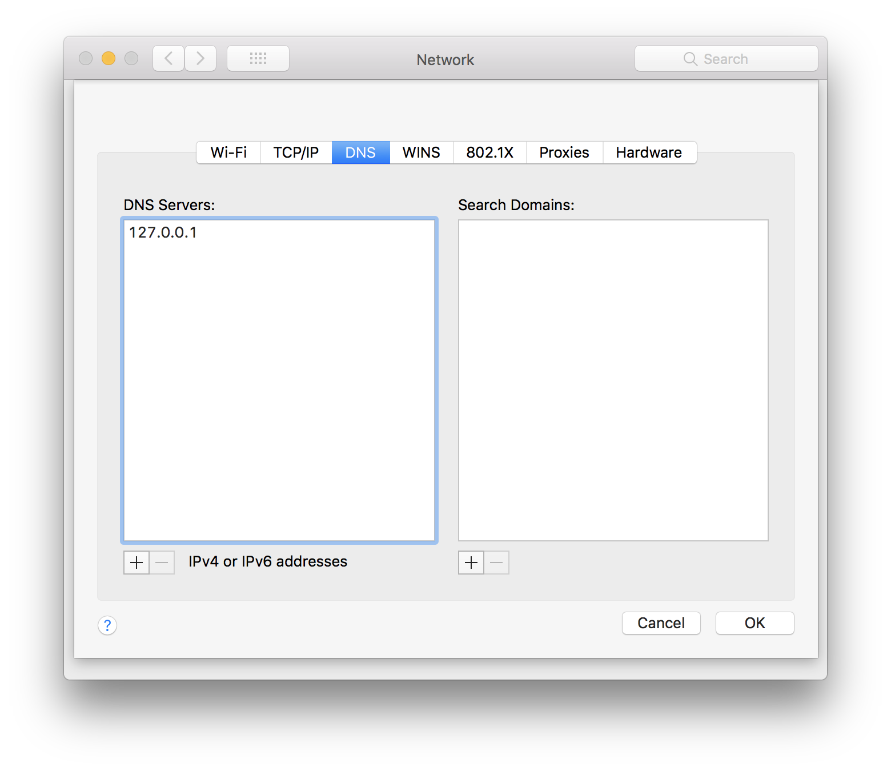

+++
slug = "tool-dns-over-tls-proxy"
title = "DNS over TLS proxy"
date = 2018-04-12
disqus_identifier = "bkrlxcs"
+++

Cloudflare has [released](https://blog.cloudflare.com/announcing-1111/) their new `1.1.1.1` [public DNS](https://www.cloudflare.com/learning/dns/what-is-1.1.1.1/) and I wanted to give it a go. The problem with DNS today is that it's unencrypted. The benefit of `1.1.1.1` is DNS requests between my computer and their DNS server would be encrypted over HTTPS or TLS.

Cloudflare's [recommended approach](https://developers.cloudflare.com/1.1.1.1/dns-over-https/cloudflared-proxy/) to proxying local DNS requests through HTTPS/TLS to `1.1.1.1` is to use their `cloudflared` tool. This felt a little odd to me though. In an effort to increase my privacy I'd be installing `cloudflared`, a tool that supports a variety of functions to integrate servers into Cloudflare for fronting their content.

I couldn't find any tools that did just this one thing without a tonne of unnecessary features. So, I created `dnsovertlsproxy`. It does one thing. It proxies DNS requests into a TLS connection to `1.1.1.1`.

Download the [binaries](https://github.com/leighmcculloch/dnsovertlsproxy/releases) for Mac, Linux or Windows, or if you're using Mac follow the instructions below.

Install on Mac OS:

brew install 4d63/dnsovertlsproxy/dnsovertlsproxy
sudo brew services start dnsovertlsproxy


Configure your computer's DNS to point to `127.0.0.1`:

Source:

- [github.com/leighmcculloch/dnsovertlsproxy](https://github.com/leighmcculloch/dnsovertlsproxy)
