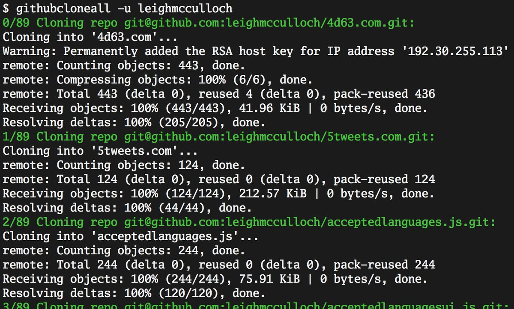

+++
slug = "tool-github-clone-all"
title = "Cloning all GitHub repos"
date = 2018-07-16
disqus_identifier = "dwhnkid"
+++

I just made `githubcloneall`. It clones all the public GitHub repositories of a user, and for the 89 public repositories I have it can clone them all in approximately one minute.

I use throw-away containers for my development environment and so often find myself needing to clone several repositories. This gets me all my repos in less time than if I was to clone just 3-4 repositories.

Download: [github.com/leighmcculloch/githubcloneall](https://github.com/leighmcculloch/githubcloneall#install)
