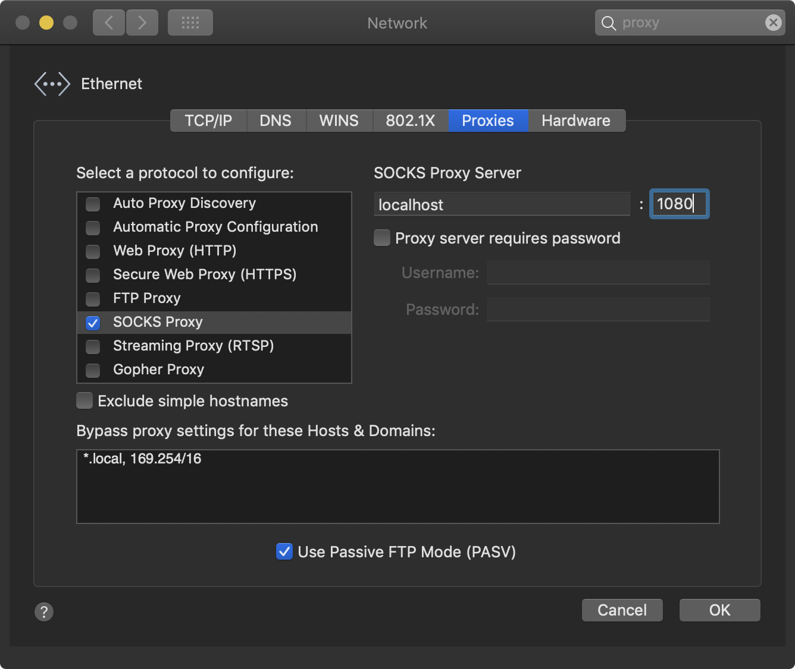
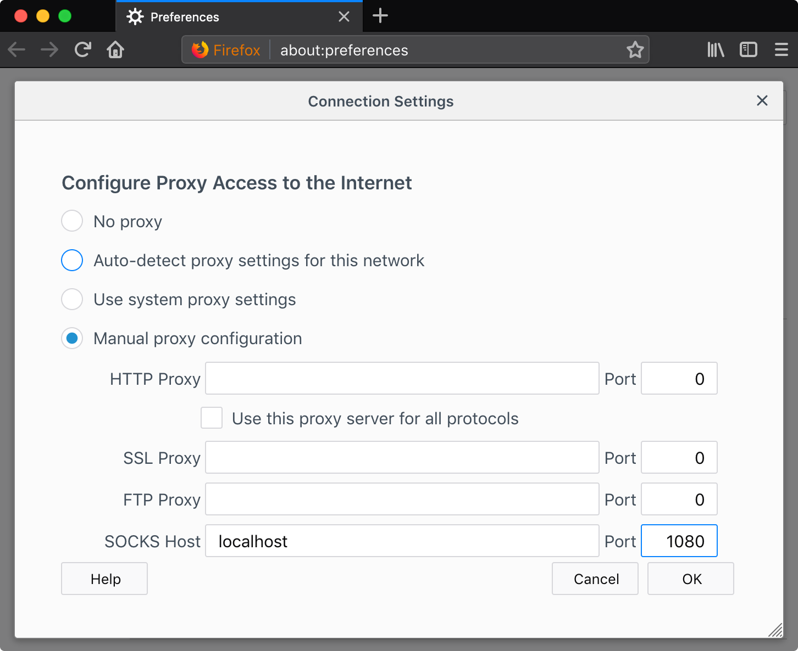

+++
slug = "tunneling-via-ssh-without-a-vpn"
title = "Tunneling via SSH without a VPN"
date = 2018-12-26
disqus_identifier = "gczowsu"
+++

Setting up a VPN can be time consuming, especially if you're like me and aren't familiar with OpenVPN. Luckily we can use SOCKS proxy settings to tunnel traffic via an SSH connection, which is much simpler to setup.

### Get a server

If you have a server to tunnel via, you can skip this part. Otherwise you'll need to setup a server you can SSH to. You could do this using AWS, DigitalOcean, Google Cloud, or whatever IaaS is hot right now.

### Connect

Open an SSH connection to the server and SSH will act as a SOCKS server.

```
ssh -N -D <port> <user>@<ip>
```

Example:
```
ssh -N -D 1080 admin@1.2.3.4
```

- `-N` Tells the other side we don't want a shell or to execute a command, because we're just port forwarding.
- `-D <port>` The localhost port that will serve the SOCKS proxy.
- `<user>@<ip>` The SSH server and username to connect to.

### Configure your browser

Configure your browser to connect to the proxy that's running on localhost. Depending on your OS and browser you set your SOCKS proxy up with:

- Host: `localhost`
- Port: `1080`

Example (Mac OS):



Example (Firefox):



### Configure DNS

Some browsers will let you also tunnel DNS via the SOCKS proxy. You may need to configure that too if that is important to you.
