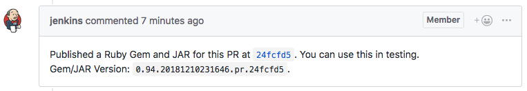

+++
slug = "continuous-deployment-of-shared-libraries-at-braintree"
title = "Continuous deployment of shared libraries at Braintree"
date = 2019-01-22
disqus_identifier = "cviabdd"
author = ["paul_gross", "leigh_mcculloch"]
canonical_url = "https://medium.com/braintree-product-technology/continuous-deployment-isnt-just-for-applications-ed78b4f4a7f6"
+++

_This post was co-authored with [Paul Gross](https://www.pgrs.net) and originally published to the Medium publication [Braintree Product and Technology](https://medium.com/braintree-product-technology) as [Continuous Deployment Isn't Just for Applications](https://medium.com/braintree-product-technology/continuous-deployment-isnt-just-for-applications-ed78b4f4a7f6)._

At [Braintree](https://www.braintreepayments.com), while we’ve been pushing more of our production services towards [continuous deployment](https://en.wikipedia.org/wiki/Continuous_deployment) for faster and safer releases, we’ve discovered we can build the ideas of continuous deployment into our culture and all areas of our stack.

We now continuously deploy important internal libraries written in both Ruby and Java, and plan to ramp up this effort to include internal tools as well. The process our engineers go through when contributing to shared libraries looks like this:

- Developers check out the shared library and make their changes
- Developers open a pull request
- [Jenkins](https://jenkins.io/) tests, builds, and publishes a test version of the library
- Pull request is reviewed and iterated upon
- While iterating, developers can upgrade to the test version in one or more applications using the shared library
- Once the pull request is merged, Jenkins publishes a new version of the library
- Developers can then upgrade the library in the applications

We’ve found that continuously deploying our libraries has eliminated repetitive tasks and helped us move quickly with shared code initiatives where a monolithic repository was not an option. New engineers can now easily integrate and contribute to libraries by reading simple scripts rather than long documentation describing our release processes. Deploying test versions from open pull requests has given engineers the ability to iterate on functionality spanning applications and shared libraries without needing to merge to master early.

Here are the steps we took to make this process as easy as possible.

## Versioning

The first big question was how to version libraries. For semantic versioning we’d use `major.minor.patch` (e.g. `v2.3.1`) but that doesn’t work as well when you are releasing every commit of the master branch.

We’ve iterated a few times on the versioning, and our current version scheme looks like `major.datetime.description.git_revision`. For example, a version for consumption might be `4.20181210231852.master.ef57297` whereas a pull request might be `0.94.20181210231646.pr.24fcfd5`.

- **Major version:** We use a major version of 0 for testing versions. And we only increment the major version when making backwards incompatible changes.
- **Pull request number:** If this is a pull request, we include the pull request number.
- **Date:** The date serves two purposes: First, it ensures that newly published versions sort higher than older versions. Second, it allows you to get a sense of how old the library is at a glance without looking up the git revision
- **Description:** We add the word master for master builds and pr for PRs. We do this to clearly signal where a version has been built from. While we use the major versions to signal this as well it’s much clearer to a human to see the description.
- **Git revision:** This allows us to know exactly which version of the code generated this release.

# Pull requests

We also wanted to encourage engineers to iterate on changes in a shared library without merging their work-in-progress to master too early. We wanted to make working across shared library boundaries as simple as possible.

To support this behavior, we build and publish a version of each shared library on every pull request with a version that never supersedes master builds. We use a major version of `0` to signal the build is not a release for the current or a future major version. We use a minor version that matches the pull request number so that consumers of the library can pin to that minor version to get updates to their pull request.

Our build system posts a comment back to the pull request with the published version to ensure new engineers discover this workflow immediately.



## Using the library

Our versioning schema means that a Ruby consumer of the library can pin themselves to a major version and pick up upgrades without breaking their integration.

For example, this would reference the latest version in in a Ruby `Gemfile` by using the tilde operator:

```ruby
gem "mylib", "~> 2.0"
```

For pull requests, it looks like this in the Ruby `Gemfile`:

```ruby
gem "mylib", "~> 0.89.0"
```

In Ruby, this means you can update the library to the latest release in the current major version with `bundle update mylib`.

Consumers are also welcome to pin to the specific version, such as this in Ruby:

```ruby
gem "mylib", "4.20181210231852.master.ef57297"
```

And in a Maven `pom.xml`:

```xml
<dependency>
  <groupId>braintree</groupId>
  <artifactId>mylib</artifactId
  <version>4.20181210231852.master.ef57297</version>
</dependency>
```

# Next steps
We’re converting more of our libraries and internal tools to this approach. Let us know how you’re building continuous deployment into your culture!

_This post was co-authored with [Paul Gross](https://www.pgrs.net) and originally published to the Medium publication [Braintree Product and Technology](https://medium.com/braintree-product-technology) as [Continuous Deployment Isn't Just for Applications](https://medium.com/braintree-product-technology/continuous-deployment-isnt-just-for-applications-ed78b4f4a7f6). Copyright &copy; 2019 PayPal._
