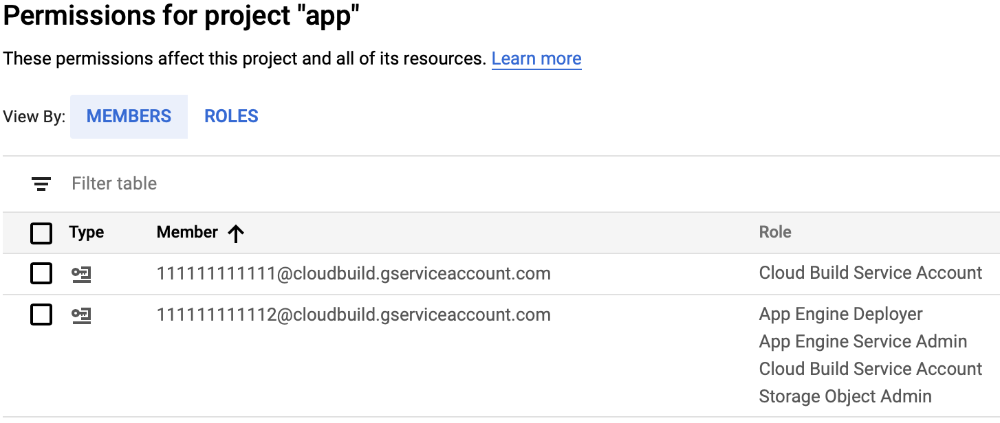
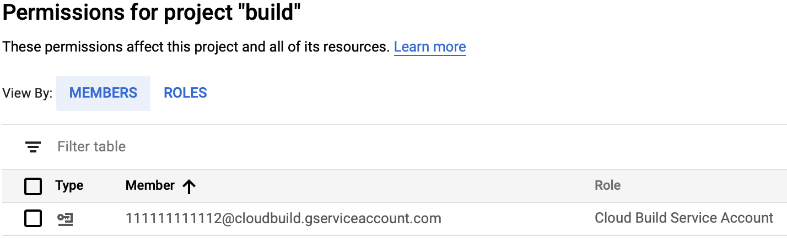

+++
slug = "continuous-deployment-to-app-engine-using-google-cloud-build"
title = "Continuous deployment to App Engine using Google Cloud Build"
date = 2019-01-03
disqus_identifier = "wblpcnl"
+++

I recently looked at how I could setup my [Google App Engine](https://cloud.google.com/appengine/) apps to continuously deploy. I host the source code for these apps in [GitHub](https://github.com) and typically use [Travis CI](https://travis-ci.com) for builds, but getting Travis CI to do the deployment would mean giving it admin credentials to App Engine and I've avoided introducing secrets into my Travis CI config because I don't like granting heavy admin permissions across services.

In July 2018 [Google Cloud Build](https://cloud.google.com/cloud-build/) added support for a [GitHub App](https://github.com/apps/google-cloud-build) integration that connects Build to GitHub. Pushes to GitHub will kick off builds in Build and Build can be configured with permissions to deploy to App Engine without needing to expose write permissions to other services.

In Google Cloud Platform most resources exist inside a project. The GitHub app will be bound to one project, so I've found if you want to deploy multiple GitHub repositories to different projects, it's more straight forward to create a separate project for connecting to GitHub. That project can be given permission to deploy to the other projects. I'll call this the build project and the other projects that I deploy to an app project.

This is what I needed to do to set it up:

**Step 1:** Install the [Google Cloud Build app](https://github.com/apps/google-cloud-build) on GitHub.

**Step 2:** [Enable App Engine's Admin API](https://console.cloud.google.com/apis/library/appengine.googleapis.com?q=app%20engine) on your build project.

**Step 3:** Get the project number of the build project from its [settings page](https://console.cloud.google.com/iam-admin/settings).

**Step 4:** In the app project [IAM page](https://console.cloud.google.com/iam-admin/iam) add a member for the build project with the name and roles below so that the build project can deploy to the app project.

Name: `<build-project-number>@cloudbuild.gserviceaccount.com`

Roles:

 - `App Engine Deployer` - Allows the build project to deploy an app.
 - `App Engine Service Admin` - Allows the build project to promote and scale a new version being deployed.
 - `Storage Object Admin` - Allows the build project to write app files to Google Cloud Storage which is part of the deployment process.
 - `Cloud Build Service Account` - Allows the build project to kick off builds of new versions being deployed.
 
The IAM pages for both the app project and build project will end up looking something like this:  





**Step 5:** Add a `cloudbuild.yaml` to the root of your repository replacing `<project-name>` with the project the app will be deployed to. E.g.:

```
steps:
- name: 'gcr.io/cloud-builders/gcloud'
  args: ['app', 'deploy', '--project=<app-project-name>', '--version=$SHORT_SHA']
```

You can use the `$SHORT_SHA` variable substitution to set the version of the App Engine deployment to match the 7 character short sha of the commit being deployed.

Push a commit to the GitHub repository and watch the Build history in the build project. You should see a new build show up that will deploy the app to the app project.
