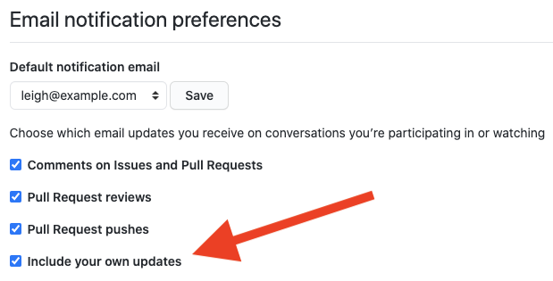
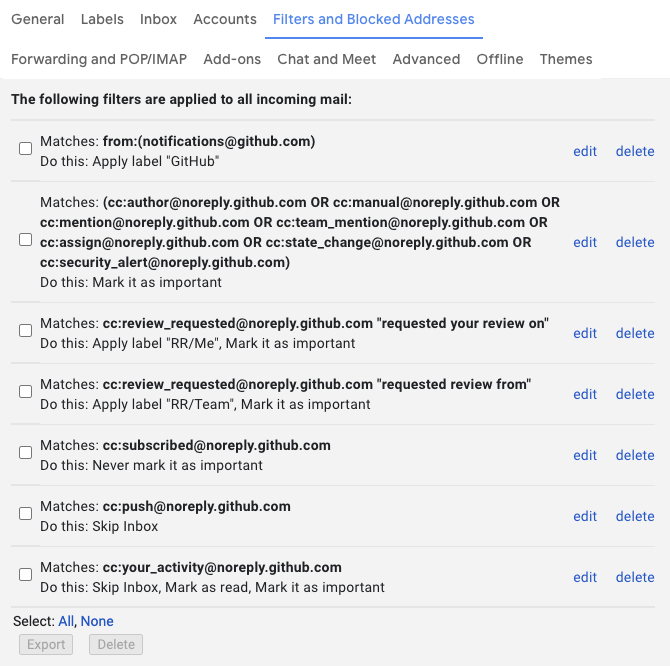

+++
slug = "filtering-github-notifications-in-gmail"
title = "Filtering GitHub Notifications in Gmail"
date = 2020-11-04
+++

GitHub sends notifications about _everything_. This is great, but also noisy. The good news is we can wrangle it with a few filters. The filters below are geared for Gmail and for making use of Gmail's Important feature where important mail is flagged and can be grouped separately when Gmail is configured with the `Priority Inbox` inbox type.

Using these filters we will see notifications that are important to us, such as review requests, mentions, and comments on issues we are involved in, flagged as important. Notifications that are the result of us being subscribed to a repository will still end up in the inbox but not marked important, and notifications like commits on pull requests will skip the inbox entirely but won't be marked as read so that the next time someone comments on that pull request we'll see all the pushes unfurled in the thread.

The filters use a set of `CC` email addresses that GitHub defines [here](https://docs.github.com/en/free-pro-team@latest/github/managing-subscriptions-and-notifications-on-github/configuring-notifications#filtering-email-notifications).

```
Matches: from:(notifications@github.com)
Do this: Apply label "GitHub"
```

```
Matches: (cc:author@noreply.github.com OR cc:manual@noreply.github.com OR cc:mention@noreply.github.com OR cc:team_mention@noreply.github.com OR cc:assign@noreply.github.com OR cc:state_change@noreply.github.com OR cc:security_alert@noreply.github.com)
Do this: Mark it as important
```

```
Matches: cc:review_requested@noreply.github.com "requested your review"
Do this: Apply label "RR/Me", Mark it as important
```

```
Matches: cc:review_requested@noreply.github.com "requested review from"
Do this: Apply label "RR/Team", Mark it as important
```

```
Matches: cc:subscribed@noreply.github.com
Do this: Never mark it as important
```

```
Matches: cc:push@noreply.github.com
Do this: Skip Inbox
```

GitHub also has an optional feature that makes this even better. We can configure GitHub to send notification emails for our own activity. If you we enable this feature we get a complete history of issues and pull requests in our email client. When enabled we use the following filter to mark our activity notifications as read and archived so that we don't see them in our inbox and only when viewing threads. We also mark the notification as important so that the thread as a whole is marked as important.

```
Matches: cc:your_activity@noreply.github.com
Do this: Skip Inbox, Mark as read, Mark it as important
```

These notifications are enabled in [GitHub's Notification settings](https://github.com/settings/notifications).



With all the above filters enabled you should see something like this:


