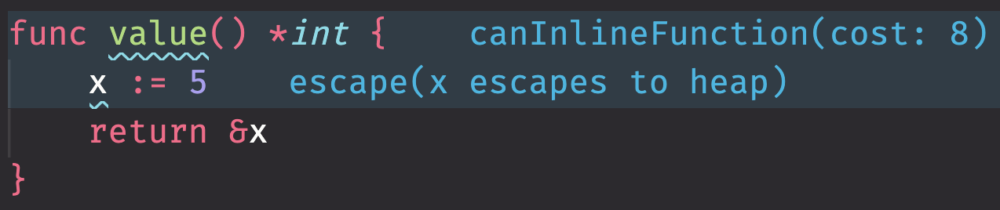

+++
slug = "go-finding-escapes-to-heap"
title = "Go: Finding Escapes to Heap"
date = 2022-12-26
image = "image.jpg"
+++

I rarely need to profile the Go code I work on, but when I do I spend most of my
time identifying code that is repeatedly pushing values to the heap, or
reallocating values on the heap that could be allocated once and reused.

Today I discovered I can get feedback in VSCode from `gopls` about where
values are escaping to the heap.

Enable the codelens that displays GC annotations by adding the following to your settings.json in VSCode:

```js
"gopls": {
    "codelenses": {
        "gc_details": true,
    },
},
```

When viewing Go code in VSCode at the top of a file will be a code lens, `Toggle
gc annotation details`. Click it, and you annotations will appear.

For the code below:

```go
func value() *int {
	x := 5
	return &x
}
```

You should see something like this:



Using the `gc_details` codelens doesn't negate the need to use `pprof` and
benchmarks to actually profile code, but it does surface straight into the IDE
allocations that are sometimes not obvious to me.

_Note: I'm using the VSCode [`usernamehw.errorlens`] extensions to display
warnings and hints inline. Your experience might look different depending on the
IDE you're using, and the extensions installed._

[`usernamehw.errorlens`]: https://marketplace.visualstudio.com/items?itemName=usernamehw.errorlens
